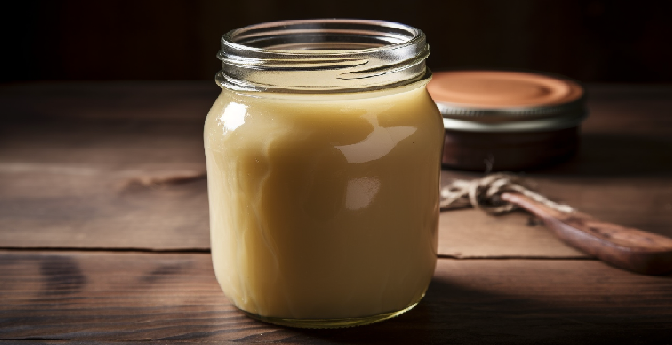

# Beef Tallow (Cooking Fat from Beef)

> Beef tallow is extracted from suet, a type of fat found around the kidneys in cows. Traditionally this was used as frying oil up until it was replaced by highly processed seed oils.
> My grand mother used to prepare it once a year from a cow and one or two pigs for the lard. Beef tallow can be used as cooking oil / fat.

# Ingredients

* 2kg of suet (I get mine directly from a small local slaughter house). Of course you can get as much as you want but keep in mind it takes some time to process it.
* salt
* A cast iron pot (works with normal pots but is far more challenging / harder to do correctly).

# Instructions

## Preparing the suet
1) Make sure the suet is a bit cold (put it in the fridge). This makes it easier to cut.
2) Cut it in chunks and shred it, but not for too long because it starts melting and doing big chunks of fat that will prevent the shredder from shedding.
3) Put the suet flakes in the cast iron pot and slowly rise the temperature.

## Rendering the tallow
1) You should not fry, burn the suet but slowly melt it. DO NOT PUT WATER it makes everything more complicated.
2) Once the process of melting started you can add progressively more and more shredded suet.
4) Keep the process of rendering into tallow, add a bit of salt.
5) Stir the pot from time to time. It might take up to 6 hours to render everything.

## Filtering
1) Use a metal strainer to filter the chunks that cannot be melted.
2) Slowly poor the tallow into glass container.
3) Let it solidify. The texture should be similar to butter and slightly hard and yellow at room temperature.
4) If its soft you might have still too much water in it.
5) The leftovers that cannot be melted are called cracklings and are considered a delicacy.

# To go further
Usually you can preserve the tallow in glass jar in a dark place. If you have a big freezer you can also store it there. You will also see sediments (very small pieces of meat / unmelted fat) going at the bottom of the jar. If you want to do a double rendering you can wait for it to be solid, cut the bottom, melt it and filter it again.

If you suspect anything bad (mold, dubious colors, etc) throw it away, it might be unsafe for consumption.

Using beef tallow instead of throwing it away also contribute to reducing the overall amount of food waste.
