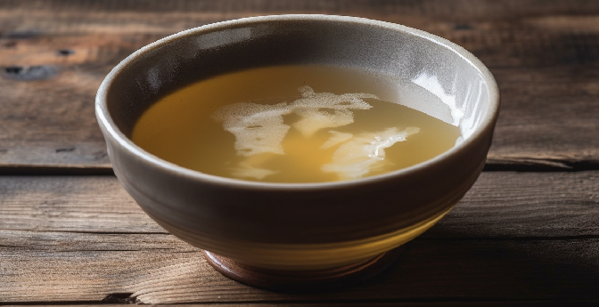

# Bone Broth

> Bone broth is a nutritious liquid made by simmering bones and vegetables for an extended period of time. Rich in vitamins, minerals, and collagen, it can be used as a base for soups, stews, and sauces or simply enjoyed as a warm, comforting beverage.

# Ingredients

For roasting:
* 3 or 4 chunks of bones
* 1 onion
* 2 garlic cloves
* 1 carrot

For boiling:
* Dried porcini mushrooms
* Salt
* Pepper
* Persley
* Marjoram
* Rosemary (optional)
* Star anise (optional)

# Instructions

## Roasting
1) Preheat the oven to 100°C.
2) Cut the onion and garlic cloves in half.
3) Wash the carrot, peel it, and cut it into chunks.
4) Place the bones, carrot, onion, and garlic in an oven-safe glass container.
5) Add a small amount of water to the container and roast the ingredients in the preheated oven for 30 minutes.

## Boiling
1) Transfer the roasted ingredients to a large pot and fill it with water.
2) Add all the remaining ingredients to the pot for extra flavor.
3) Bring the water to a boil, then reduce the heat and let it simmer at a low temperature for 6 hours.

## Straining and Storing
1) Use a fine mesh strainer to separate the solids from the liquid.
2) Discard the solids and let the broth cool.
3) Once cooled, transfer the broth to an airtight container and store it in the refrigerator for up to a week or freeze it for up to six months.

# To go further
For a richer flavor, roast the bones and vegetables for a longer period at a higher temperature, around 180°C.

Adding a splash of vinegar to the boiling water can help extract more nutrients from the bones.
